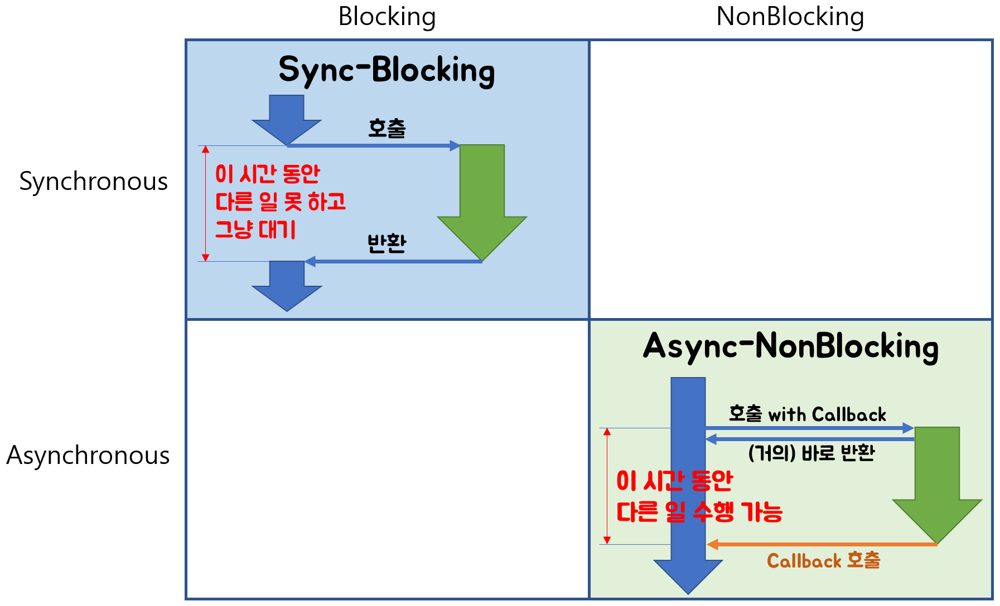
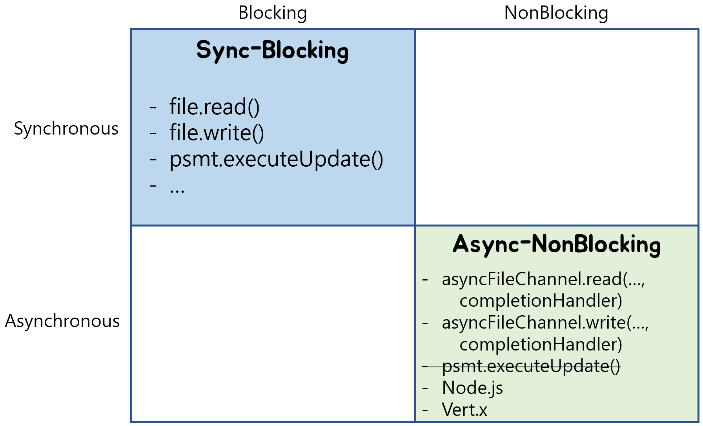

## 동기 (Synchronous)

동기는 말 그대로 동시에 일어난다는 뜻입니다. 요청과 동시에 결과를 받아야 하며 바로 요청을 하면 시간이 얼마가 걸리던지 요청한 자리에서 결과가 주어져야 합니다.

요청과 동시에 결과를 표시해야하기에 코드를 직관적으로 작성할 수 있으나 요청을 받게 되면 결과를 받을 때 까지 다른 작업을 할 수 없는 단점이 있습니다.

## 비동기 (Asynchronous)

비동기는 동시에 일어나지 않는다를 의미합니다. 요청과 결과가 동시에 일어나지 않습니다.

동기보단 코드가 복잡할 수 있으나 요청을 하고 결과를 처리하는 동안에 다른 일을 처리할 수 있는 장점이 있습니다.

## 블로킹 (Blocking)

직접 제어할 수 없는 대상의 작업이 호출되면 끝날 때까지 제어권을 넘겨주지 않는 것이다. 예를 들어 호출하는 함수가 IO를 요청했을 때 IO처리가 완료될 때까지 아무 일도 하지 못한 채 기다리는 것을 말한다.

## 논블로킹 (Non-Blocking)

직접 제어할 수 없는 대상의 작업이 호출함과 동시에 제어권이 돌아오며, 다른 작업을 진행할 수 있다. 예를 들어 호출하는 함수가 IO를 요청한 후 IO처리 완료 여부와 상관없이 바로 자신의 작업을 할 수 있다.

<!-- ## 의문점

위에서 언급한 내용들을 보면 이렇게 떠올릴 수도 있습니다.

이렇게도 떠올릴수도 있겠습니다.

## 다른점

'의문점'에서 본대로 비슷하게 보이는 부분끼리 묶은 후 다른점을 살펴보겠습니다.
 -->

## 참조문서

<https://private.tistory.com/24>

<https://siyoon210.tistory.com/147>

<https://sjh836.tistory.com/109>

<https://homoefficio.github.io/2017/02/19/Blocking-NonBlocking-Synchronous-Asynchronous/>

<https://grip.news/archives/1304>

<https://nesoy.github.io/articles/2017-01/Synchronized>
